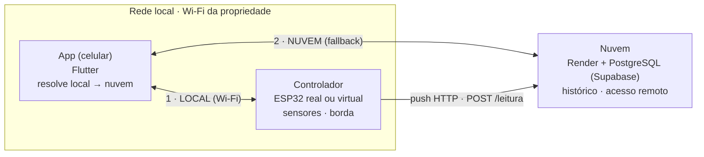

# Diagramas do TCC (fontes editáveis)

Fontes dos diagramas do artigo, em código, para renderizar e exportar como
imagem. Fiéis ao schema/código do projeto — atualizar aqui se o código mudar.

**Como gerar a imagem para o Word:** cole o bloco em <https://mermaid.live>,
depois use *Actions → PNG* (ou SVG) e insira no documento. Para PNG de alta
resolução, aumente o zoom antes de exportar.

---

## 1. DER — banco de dados em nuvem (PostgreSQL/Supabase)

Escopo: persistência na nuvem. As entidades de *estufada* e *eventos* ficam hoje
no banco local do app (Isar, NoSQL) e não entram neste DER relacional.
Fonte: `database/schema.sql`.

```mermaid
erDiagram
    dispositivos ||--|| configuracoes : "tem"
    dispositivos ||--o{ leituras : "gera"
    dispositivos ||--o{ comandos_sync : "recebe"

    dispositivos {
        uuid id PK
        text nome
        text identificador_hardware UK
        text tipo_dispositivo
        text ip_local
        boolean ativo
        timestamptz created_at
        timestamptz updated_at
    }
    configuracoes {
        uuid dispositivo_id PK_FK
        numeric temperatura_meta
        bigint temp_timestamp
        numeric umidade_meta
        bigint umid_timestamp
        boolean modo_silencioso
        bigint modo_silencioso_timestamp
        timestamptz updated_at
    }
    leituras {
        bigserial id PK
        uuid dispositivo_id FK
        timestamptz timestamp_leitura
        bigint timestamp_origem_ms
        numeric temperatura
        numeric umidade
        numeric temperatura_meta
        numeric umidade_meta
        boolean alerta_incendio
        text aviso
        text cor_status
        text fase_atual
        boolean tem_energia
        boolean tem_internet
        integer sinal_wifi
        boolean aquecedor_ligado
        boolean ventilador_ligado
        boolean umidificador_ligado
        text fonte
        timestamptz created_at
    }
    comandos_sync {
        bigserial id PK
        uuid dispositivo_id FK
        text identificador_hardware
        jsonb payload
        text status
        text origem
        text erro
        timestamptz created_at
        timestamptz synced_at
    }
```

Relacionamentos e regras (do schema):
- `dispositivos` 1:1 `configuracoes` (a PK de `configuracoes` é também FK;
  `on delete cascade`).
- `dispositivos` 1:N `leituras` (`on delete cascade`).
- `dispositivos` 1:N `comandos_sync` (`on delete set null` — a FK aceita nulo).
- `identificador_hardware` é único em `dispositivos`.
- Checks de domínio: `tipo_dispositivo ∈ {simulador, hardware}`;
  `leituras.fonte ∈ {simulador, hardware, manual}`;
  `comandos_sync.status ∈ {pendente, enviado, aplicado, ignorado, erro}`;
  `comandos_sync.origem ∈ {app, hardware, simulador, admin}`.

---

## 2. Arquitetura híbrida (app ↔ controlador ↔ nuvem)

Fontes: `DEMO.md`, `api_service.dart` (resolução local → porta 80 → nuvem).



Modos: **LOCAL** (app lê o aparelho pela Wi-Fi, sem internet — prioridade);
**NUVEM** (assume quando o local não responde); **OFFLINE** (nenhum acessível —
comandos e leituras ficam em fila até reconectar).

## 3. Sequência da sincronização (fila offline + Last-Write-Wins)

Fontes: `DEMO.md` (cenário 3), lógica de sync do servidor e da fila local.

```mermaid
sequenceDiagram
    actor U as Usuário
    participant A as App
    participant F as Fila local (Isar)
    participant C as Controlador

    U->>A: altera ajuste de temperatura
    A->>C: tenta enviar comando
    C-->>A: inacessível (offline)
    A->>F: enfileira comando + timestamp
    F-->>A: pendente
    Note over A: UI: "comando enfileirado"

    Note over U,C: aparelho volta · próxima leitura

    A->>F: busca comandos pendentes
    F-->>A: comando + timestamp
    A->>C: POST /sincronizar
    Note over C: aplica Last-Write-Wins por campo:<br/>o timestamp mais recente vence;<br/>comando antigo é ignorado
    C-->>A: estado atualizado
    A->>F: marca como sincronizado
```
